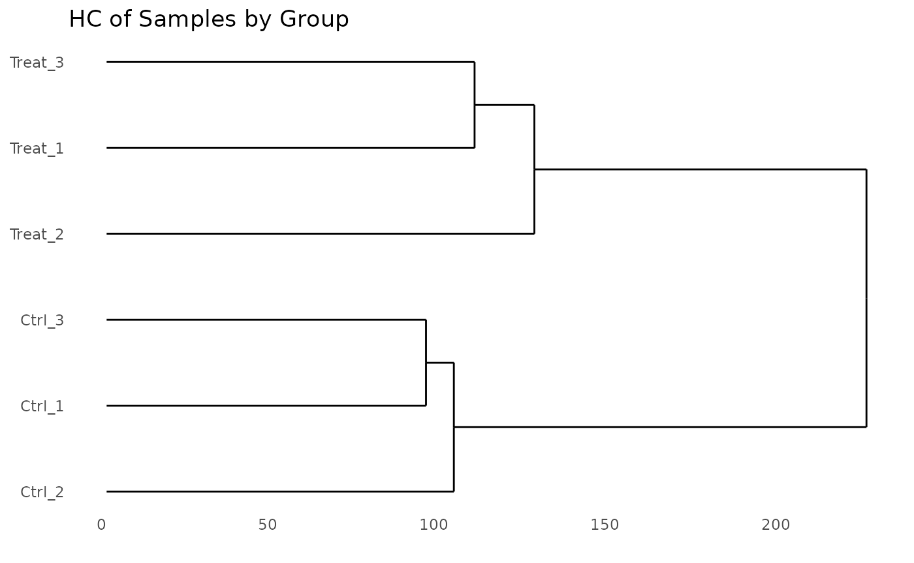
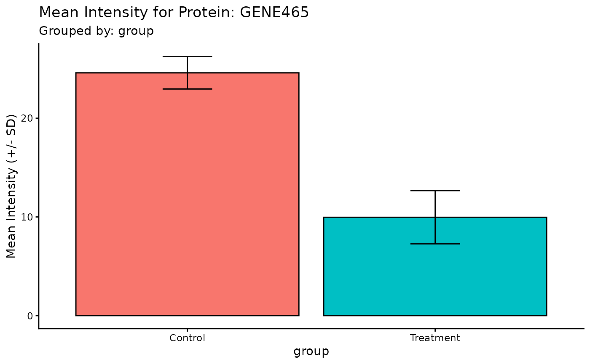

# getting-started

## Introduction

The `ProtPipe` package provides a streamlined, start-to-finish workflow
for common proteomics data analysis tasks. It is built around a central
`ProtData` object, which stores quantitative data, protein metadata, and
sample metadata in a single, cohesive unit. This vignette will walk you
through a typical analysis, from data loading to quality control and
visualization.

## Setup and Data Loading

First, we load the `ProtPipe` package.

``` r
library(ProtPipe)
#> 
library(SummarizedExperiment)
#> Loading required package: MatrixGenerics
#> Loading required package: matrixStats
#> 
#> Attaching package: 'MatrixGenerics'
#> The following objects are masked from 'package:matrixStats':
#> 
#>     colAlls, colAnyNAs, colAnys, colAvgsPerRowSet, colCollapse,
#>     colCounts, colCummaxs, colCummins, colCumprods, colCumsums,
#>     colDiffs, colIQRDiffs, colIQRs, colLogSumExps, colMadDiffs,
#>     colMads, colMaxs, colMeans2, colMedians, colMins, colOrderStats,
#>     colProds, colQuantiles, colRanges, colRanks, colSdDiffs, colSds,
#>     colSums2, colTabulates, colVarDiffs, colVars, colWeightedMads,
#>     colWeightedMeans, colWeightedMedians, colWeightedSds,
#>     colWeightedVars, rowAlls, rowAnyNAs, rowAnys, rowAvgsPerColSet,
#>     rowCollapse, rowCounts, rowCummaxs, rowCummins, rowCumprods,
#>     rowCumsums, rowDiffs, rowIQRDiffs, rowIQRs, rowLogSumExps,
#>     rowMadDiffs, rowMads, rowMaxs, rowMeans2, rowMedians, rowMins,
#>     rowOrderStats, rowProds, rowQuantiles, rowRanges, rowRanks,
#>     rowSdDiffs, rowSds, rowSums2, rowTabulates, rowVarDiffs, rowVars,
#>     rowWeightedMads, rowWeightedMeans, rowWeightedMedians,
#>     rowWeightedSds, rowWeightedVars
#> Loading required package: GenomicRanges
#> Loading required package: stats4
#> Loading required package: BiocGenerics
#> Loading required package: generics
#> 
#> Attaching package: 'generics'
#> The following objects are masked from 'package:base':
#> 
#>     as.difftime, as.factor, as.ordered, intersect, is.element, setdiff,
#>     setequal, union
#> 
#> Attaching package: 'BiocGenerics'
#> The following objects are masked from 'package:stats':
#> 
#>     IQR, mad, sd, var, xtabs
#> The following objects are masked from 'package:base':
#> 
#>     anyDuplicated, aperm, append, as.data.frame, basename, cbind,
#>     colnames, dirname, do.call, duplicated, eval, evalq, Filter, Find,
#>     get, grep, grepl, is.unsorted, lapply, Map, mapply, match, mget,
#>     order, paste, pmax, pmax.int, pmin, pmin.int, Position, rank,
#>     rbind, Reduce, rownames, sapply, saveRDS, table, tapply, unique,
#>     unsplit, which.max, which.min
#> Loading required package: S4Vectors
#> 
#> Attaching package: 'S4Vectors'
#> The following object is masked from 'package:utils':
#> 
#>     findMatches
#> The following objects are masked from 'package:base':
#> 
#>     expand.grid, I, unname
#> Loading required package: IRanges
#> Loading required package: Seqinfo
#> Loading required package: Biobase
#> Welcome to Bioconductor
#> 
#>     Vignettes contain introductory material; view with
#>     'browseVignettes()'. To cite Bioconductor, see
#>     'citation("Biobase")', and for packages 'citation("pkgname")'.
#> 
#> Attaching package: 'Biobase'
#> The following object is masked from 'package:MatrixGenerics':
#> 
#>     rowMedians
#> The following objects are masked from 'package:matrixStats':
#> 
#>     anyMissing, rowMedians
library(ggplot2) # For plot customization
```

Our analysis begins with two primary data frames:

1.  A `data.frame` containing protein metadata and quantitative
    intensity data for each sample.
2.  A `data.frame` containing the experimental design, mapping each
    sample to its condition.

``` r
# 1. Create a sample raw data frame
# 1. Create a more realistic sample raw data frame
# We will simulate 50 genes in total:
# - 40 genes that are stable (no change between conditions)
# - 5 genes that are up-regulated in the Treatment group
# - 5 genes that are down-regulated in the Treatment group
n_stable <- 400
n_up <- 50
n_down <- 50
n_total <- n_stable + n_up + n_down

# Set means for each group for log2-scale data
mean_stable <- 25
mean_up <- 51  # Higher expression
mean_down <- 12 # Lower expression

# Note: set.seed() makes the random data reproducible
set.seed(123) 

# Simulate data for each sample group
data <- data.frame(
  Ctrl_1 = rnorm(n_total, mean = mean_stable, sd = 2),
  Ctrl_2 = rnorm(n_total, mean = mean_stable, sd = 2.5),
  Ctrl_3 = rnorm(n_total, mean = mean_stable, sd = 2.2),
  Treat_1 = c(rnorm(n_stable, mean_stable, 2), rnorm(n_up, mean_up, 2), rnorm(n_down, mean_down, 2)),
  Treat_2 = c(rnorm(n_stable, mean_stable, 2.5), rnorm(n_up, mean_up, 2.5), rnorm(n_down, mean_down, 2.5)),
  Treat_3 = c(rnorm(n_stable, mean_stable, 2.2), rnorm(n_up, mean_up, 2.2), rnorm(n_down, mean_down, 2.2))
)

# Introduce some missing values (NAs) to make it more realistic
# Set ~5% of the intensity values to NA
num_cells <- ncol(data) * n_total
na_indices <- sample(num_cells, size = round(0.05 * num_cells))
data <- as.matrix(data)
data[na_indices] <- NA
data <- as.data.frame(data)

# Combine into a single data frame with protein metadata
raw_data <- data.frame(
  ProteinID = paste0("P", 1:n_total),
  Gene = paste0("GENE", 1:n_total),
  Status = c(rep("Stable", n_stable), rep("Upregulated", n_up), rep("Downregulated", n_down)),
  data
)

# 2. Create the corresponding condition data frame
cond_df <- data.frame(
   SampleID = c("Ctrl_1", "Ctrl_2", "Ctrl_3", "Treat_1", "Treat_2", "Treat_3"),
   group = c("Control", "Control", "Control", "Treatment", "Treatment", "Treatment"),
   batch = c("A", "B", "A", "B", "A", "B")
)

# 3. Use the constructor to create the ProtData object
pd_obj <- ProtPipe::create_se(data = raw_data, sample_metadata = cond_df)
#> `intensity_cols` not provided. Detecting numeric columns as intensity data.

# We can inspect the created object
print(pd_obj)
#> class: SummarizedExperiment 
#> dim: 500 6 
#> metadata(2): creation_method processing_log
#> assays(1): intensities
#> rownames: NULL
#> rowData names(3): ProteinID Gene Status
#> colnames(6): Ctrl_1 Ctrl_2 ... Treat_2 Treat_3
#> colData names(2): group batch
```

## Initial Quality Control (QC)

Before normalization and analysis, we should assess the quality of our
data.

### Protein Counts and Intensity Distributions

We can check the number of proteins identified in each sample and
visualize the intensity distributions with boxplots.

``` r
# Get the number of identified proteins per sample
ProtPipe::get_pg_counts(pd_obj)
#>          Sample Protein_Groups
#> Ctrl_1   Ctrl_1            478
#> Ctrl_2   Ctrl_2            482
#> Ctrl_3   Ctrl_3            471
#> Treat_1 Treat_1            469
#> Treat_2 Treat_2            477
#> Treat_3 Treat_3            473

# Plot the counts for each sample
ProtPipe::plot_pg_counts(pd_obj)
#> Warning: Use of `pgcounts$Protein_Groups` is discouraged.
#> ℹ Use `Protein_Groups` instead.
#> Ignoring unknown labels:
#> • fill : ""
```


``` r

# Plot the intensity distributions for each sample
ProtPipe::plot_pg_intensities(pd_obj)
#> Ignoring unknown labels:
#> • fill : ""
```

 These plots help
us identify any samples that behave as strong outliers.

### Sample Correlation

Next, we can assess the reproducibility between replicates by plotting a
correlation heatmap. Samples from the same condition should generally
cluster together.

``` r
ProtPipe::plot_correlation_heatmap(pd_obj, order_by = "group", label_by = "group")
#> No numeric values detected in ordering variable. Applying alphanumeric sort.
#> Warning: Using `size` aesthetic for lines was deprecated in ggplot2 3.4.0.
#> ℹ Please use `linewidth` instead.
#> ℹ The deprecated feature was likely used in the ProtPipe package.
#>   Please report the issue to the authors.
#> This warning is displayed once per session.
#> Call `lifecycle::last_lifecycle_warnings()` to see where this warning was
#> generated.
```


## Data Pre-processing

`ProtPipe` includes functions for common pre-processing steps like
normalization and imputation.

### Normalization

Here, we apply median normalization to align the intensity distributions
across all samples.

``` r
pd_obj_normalized <- ProtPipe::median_normalize(pd_obj)

# We can re-plot the intensities to see the effect of normalization
ProtPipe::plot_pg_intensities(pd_obj_normalized)
#> Ignoring unknown labels:
#> • fill : ""
```


### Imputation

Missing values must be handled before many downstream analyses. We will
use the “down-shifted normal” (Perseus-like) imputation method. As this
is a stochastic method, we set a seed for reproducibility.

``` r
set.seed(123) # Set a seed for reproducible imputation
pd_obj_imputed <- ProtPipe::impute_left_dist(pd_obj_normalized)

# The object should no longer have missing values
any(is.na(assay(pd_obj_imputed)))
#> [1] FALSE

# Create a preprocessing report 
report <- generate_preprocessing_report(pd_obj_imputed)
#> Preprocessing report written to: preprocessing_report.md
```

## Downstream Analysis and Visualization

With a clean, complete dataset, we can now explore the relationships
between samples and proteins.

### Hierarchial Clustering (PCA)

``` r
# The plot_pca function is a convenient wrapper that calculates and plots the results
ProtPipe::plot_hierarchical_cluster(pd_obj_imputed) +
  labs(title = "HC of Samples by Group")
```

 \### Principal
Component Analysis (PCA)

PCA is a powerful tool for visualizing the primary sources of variation
in the data and assessing sample clustering.

``` r
# The plot_pca function is a convenient wrapper that calculates and plots the results
ProtPipe::plot_PCs(pd_obj_imputed, condition = "group") +
  labs(title = "PCA of Samples by Group")
```


### UMAP

Lets plot a UMAP.

``` r
# The plot_pca function is a convenient wrapper that calculates and plots the results
ProtPipe::plot_umap(pd_obj_imputed, condition = "group", neighbors = 4) +
  labs(title = "UMAP of Samples by Group")
```

 \### Differential
Expression

Lets figure out which proteins are altered by the treatment.

``` r
DE <- ProtPipe::do_limma_binary(pd_obj_imputed, condition = "group", control_group = "Control", treatment_group = "Treatment")

# Or, filter to a specific subset of genes of interest
ProtPipe::plot_volcano(
  DE, 
  label_col = "Gene"
)
```

 \### Protein
Barchart

Lets take a closer look at some of the differentially expressed proteins

``` r
# Plot a heatmap of all proteins, with columns ordered by clustering
ProtPipe::compare_protein(pd_obj_imputed, prot = "GENE465", prot_meta_col = "Gene", condition = "group")
```



### Protein Expression Heatmap

Finally, we can visualize the expression patterns of the proteins across
our samples using a heatmap. The data is automatically Z-scored by row
to highlight relative expression changes.

``` r
# Plot a heatmap of all proteins, with columns ordered by clustering
ProtPipe::plot_proteomics_heatmap(pd_obj_imputed, protmeta_col = "Gene")
```


``` r

# Or, filter to a specific subset of genes of interest
ProtPipe::plot_proteomics_heatmap(
  pd_obj_imputed, 
  protmeta_col = "Gene", 
  genes = c("GENE1", "GENE2", "GENE3", "GENE4")
)
```


## Conclusion

This vignette demonstrated a complete analysis workflow using the
`ProtPipe` package. By combining data and metadata into a `ProtData`
object, we can apply a series of QC, pre-processing, and visualization
steps in a clear and reproducible pipeline.
