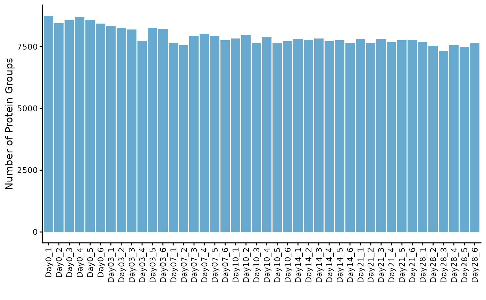
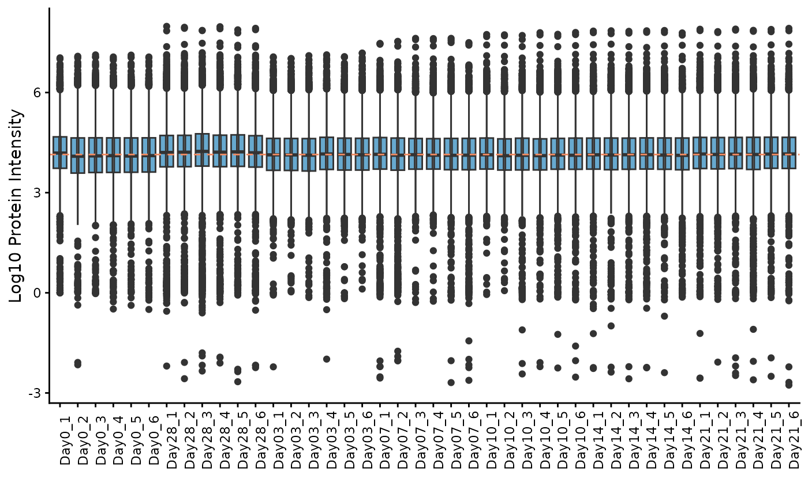
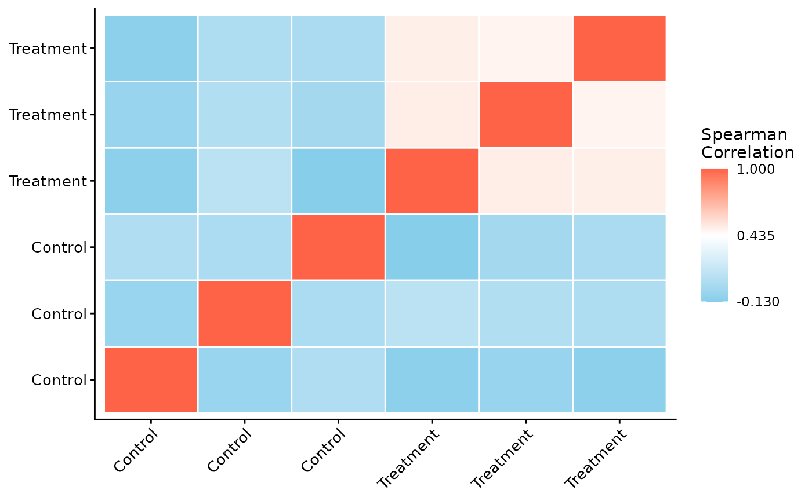
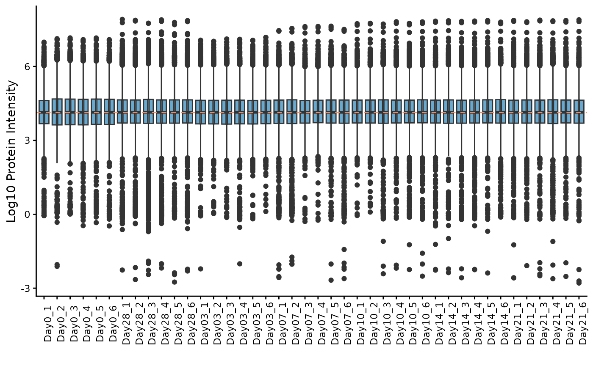
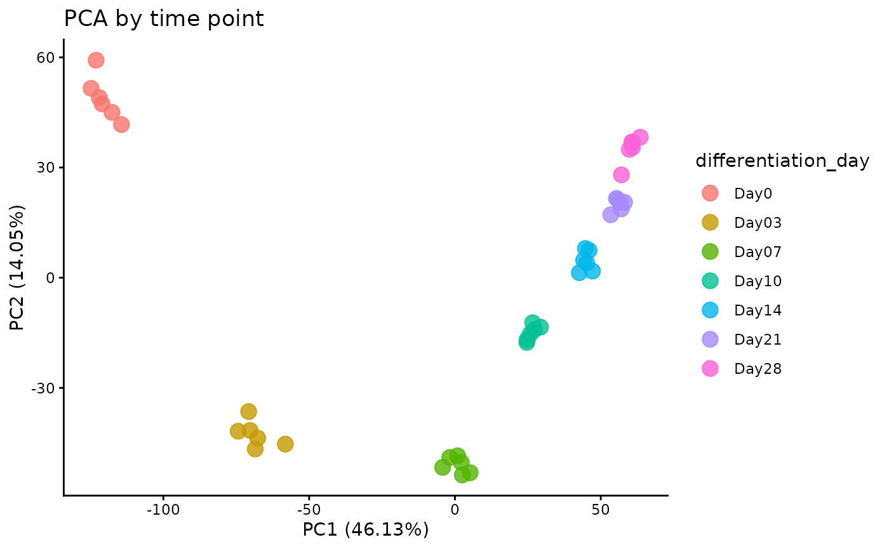
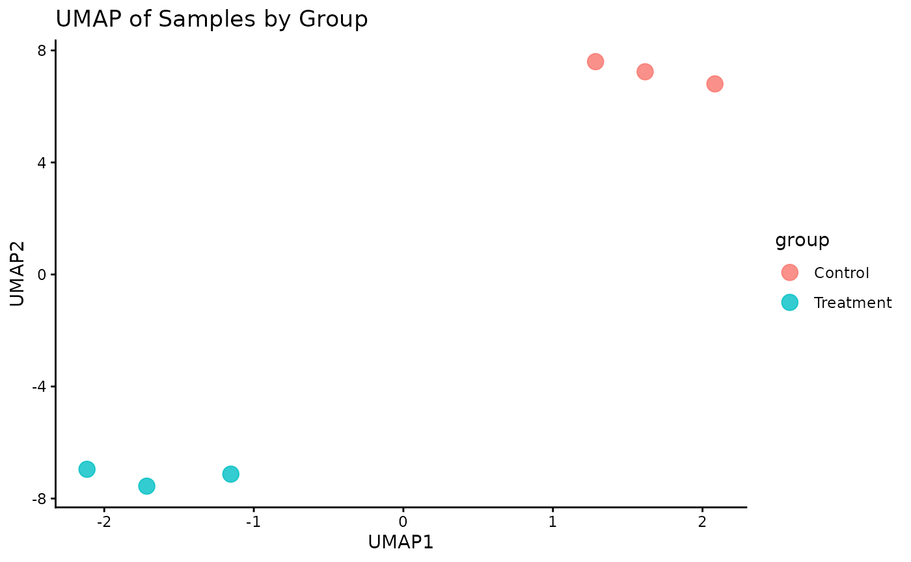
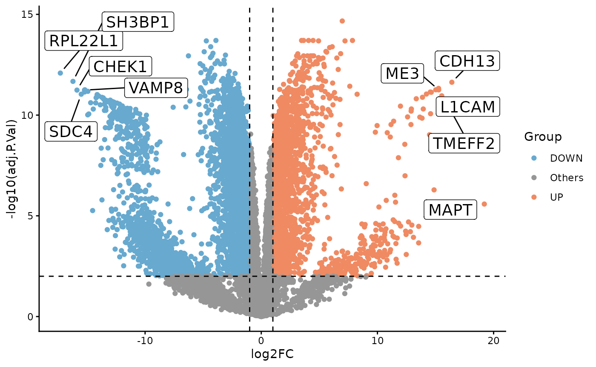
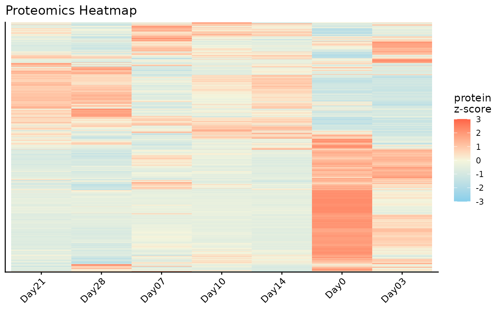
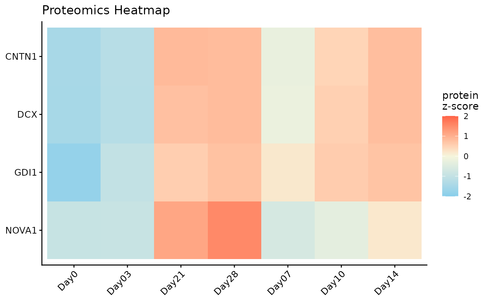

# getting-started

## Introduction

The `ProtPipe` package provides downstream proteomics workflows based on
`SummarizedExperiment`. This vignette uses a packaged example object so
the analysis starts from a ready-to-use dataset rather than
reconstructing the object from raw files.

## Setup and Data Loading

First, we load the `ProtPipe` package.

``` r

suppressPackageStartupMessages(library(ProtPipe2))
library(SummarizedExperiment)
library(ggplot2) # For plot customization
```

Load the packaged example object with
[`data()`](https://rdrr.io/r/utils/data.html). This object was created
from `EXAMPLES/basic_example_data/iPSC.csv` without supplying external
sample metadata, so the only sample annotation present initially is
`differentiation_day`.

``` r

data("protpipe_example_se")
se <- protpipe_example_se

se
#> class: SummarizedExperiment 
#> dim: 9119 42 
#> metadata(2): creation_method processing_log
#> assays(1): intensities
#> rownames: NULL
#> rowData names(2): PG.ProteinGroups PG.Genes
#> colnames(42): Day0_1 Day0_2 ... Day21_5 Day21_6
#> colData names(1): differentiation_day
colData(se)
#> DataFrame with 42 rows and 1 column
#>         differentiation_day
#>                 <character>
#> Day0_1                 Day0
#> Day0_2                 Day0
#> Day0_3                 Day0
#> Day0_4                 Day0
#> Day0_5                 Day0
#> ...                     ...
#> Day21_2               Day21
#> Day21_3               Day21
#> Day21_4               Day21
#> Day21_5               Day21
#> Day21_6               Day21
```

## Initial Quality Control (QC)

Before normalization and analysis, we should assess the quality of our
data.

### Protein Counts and Intensity Distributions

We can check the number of proteins identified in each sample and
visualize the intensity distributions with boxplots.

``` r

# Get the number of identified proteins per sample
ProtPipe2::get_pg_counts(se)
#>          Sample Protein_Groups
#> Day0_1   Day0_1           8746
#> Day0_2   Day0_2           8451
#> Day0_3   Day0_3           8571
#> Day0_4   Day0_4           8697
#> Day0_5   Day0_5           8592
#> Day0_6   Day0_6           8433
#> Day28_1 Day28_1           7686
#> Day28_2 Day28_2           7541
#> Day28_3 Day28_3           7305
#> Day28_4 Day28_4           7570
#> Day28_5 Day28_5           7500
#> Day28_6 Day28_6           7631
#> Day03_1 Day03_1           8334
#> Day03_2 Day03_2           8261
#> Day03_3 Day03_3           8193
#> Day03_4 Day03_4           7734
#> Day03_5 Day03_5           8259
#> Day03_6 Day03_6           8229
#> Day07_1 Day07_1           7660
#> Day07_2 Day07_2           7569
#> Day07_3 Day07_3           7939
#> Day07_4 Day07_4           8026
#> Day07_5 Day07_5           7935
#> Day07_6 Day07_6           7755
#> Day10_1 Day10_1           7835
#> Day10_2 Day10_2           7965
#> Day10_3 Day10_3           7663
#> Day10_4 Day10_4           7902
#> Day10_5 Day10_5           7629
#> Day10_6 Day10_6           7724
#> Day14_1 Day14_1           7813
#> Day14_2 Day14_2           7777
#> Day14_3 Day14_3           7827
#> Day14_4 Day14_4           7725
#> Day14_5 Day14_5           7756
#> Day14_6 Day14_6           7653
#> Day21_1 Day21_1           7810
#> Day21_2 Day21_2           7654
#> Day21_3 Day21_3           7815
#> Day21_4 Day21_4           7696
#> Day21_5 Day21_5           7765
#> Day21_6 Day21_6           7771

# Plot the counts for each sample
ProtPipe2::plot_pg_counts(se)
```



``` r


# Plot the intensity distributions for each sample
ProtPipe2::plot_pg_intensities(se)
```

 These plots help
us identify any samples that behave as strong outliers.

### Sample Correlation

Next, we can assess the reproducibility between replicates by plotting a
correlation heatmap. Samples from the same condition should generally
cluster together.

``` r

ProtPipe2::plot_correlation_heatmap(se)
```



## Data Pre-processing

`ProtPipe` includes functions for common pre-processing steps like
normalization and imputation.

### Normalization

Here, we apply median normalization to align the intensity distributions
across all samples.

``` r

se_normalized <- ProtPipe2::median_normalize(se)

# We can re-plot the intensities to see the effect of normalization
ProtPipe2::plot_pg_intensities(se_normalized)
```



### Imputation

Missing values must be handled before many downstream analyses. We will
use the “down-shifted normal” (Perseus-like) imputation method. As this
is a stochastic method, we set a seed for reproducibility.

``` r

set.seed(123) # Set a seed for reproducible imputation
se_imputed <- ProtPipe2::impute_left_dist(se_normalized)

# The object should no longer have missing values
any(is.na(assay(se_imputed)))
#> [1] FALSE

# Create a preprocessing report 
report <- generate_preprocessing_report(se_imputed)
```

## Downstream Analysis and Visualization

With a clean, complete dataset, we can now explore the relationships
between samples and proteins.

### Principal Component Analysis (PCA)

PCA is a powerful tool for visualizing the primary sources of variation
in the data and assessing sample clustering.

``` r

# The plot_pca function is a convenient wrapper that calculates and plots the results
ProtPipe2::plot_PCs(se_imputed, condition = "differentiation_day") +
  labs(title = "PCA by time point")
```



### UMAP

Lets plot a UMAP.

``` r

# The plot_pca function is a convenient wrapper that calculates and plots the results
ProtPipe2::plot_umap(se_imputed, condition = "differentiation_day", neighbors = 6) +
  labs(title = "UMAP by time point")
```



### Differential Expression

To illustrate a simple two-group comparison, we compare Day 28 and Day 0
directly with limma.

``` r

de <- ProtPipe2::do_limma_binary(
  se_imputed,
  condition = "differentiation_day",
  control_group = "Day0",
  treatment_group = "Day28"
)

ProtPipe2::plot_volcano(
  de,
  label_col = "PG.Genes"
)
```



### Pathway Analysis

We can perform a simple Gene Ontology enrichment analysis on the
differential expression results.

``` r

pathways <- ProtPipe2::enrich_pathways(
  de,
  gene_col = "PG.Genes",
  source = "go",
  run_gsea = FALSE,
  run_kegg = FALSE
)

pathways$plots$ora_up_dotplot
#> NULL
```

### Protein Expression Heatmap

Finally, we can visualize the expression patterns of the proteins across
our samples using a heatmap. The data is automatically Z-scored by row
to highlight relative expression changes.

``` r

# Plot a heatmap of all proteins with row and column clustering
ProtPipe2::plot_proteomics_heatmap(
  se_imputed,
  protmeta_col = "PG.Genes",
  condition = "differentiation_day",
  cluster_rows = TRUE,
  cluster_cols = TRUE
)
#> Condition provided. Summarizing replicates into means...
```



``` r


top_genes <- unique(stats::na.omit(de$PG.Genes))[1:4]

ProtPipe2::plot_proteomics_heatmap(
  se_imputed,
  protmeta_col = "PG.Genes",
  condition = "differentiation_day",
  genes = top_genes,
  cluster_rows = TRUE,
  cluster_cols = TRUE
)
#> Condition provided. Summarizing replicates into means...
```



## Conclusion

This vignette demonstrated a complete ProtPipe workflow starting from a
packaged `SummarizedExperiment`. The same pattern extends to
user-supplied objects constructed with
[`create_se()`](https://nih-card.github.io/ProtPipe2/docs/reference/create_se.md).
