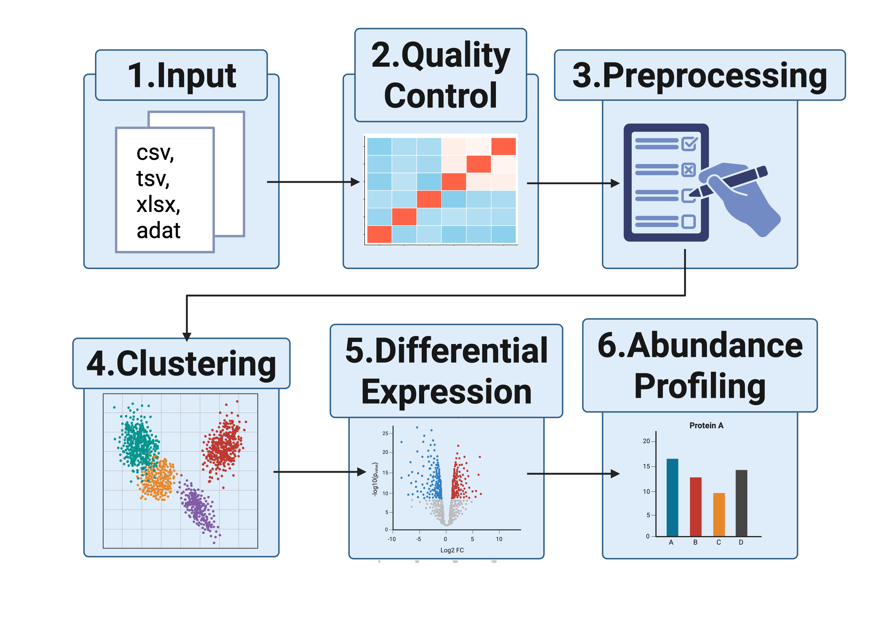

# ProtPipe2



ProtPipe2 provides reproducible workflows for downstream proteomics
analysis through the ProtPipe R package and a Shiny interface. The
package supports data import into `SummarizedExperiment`, quality
control, filtering, normalization, imputation, batch correction,
dimensionality reduction, clustering, differential intensity analysis,
and abundance profiling. It also includes visualization and pathway or
gene set enrichment utilities for interpretation of protein-level
results.

## Installation

``` r
if (!requireNamespace("pak", quietly = TRUE)) {
  install.packages("pak")
}
pak::pak("NIH-CARD/ProtPipe2")
library(ProtPipe)
```

The package installs a minimal core dependency set by default. Some
optional features require extra packages:

- [`ProtPipe::run_protpipe_shiny()`](https://nih-card.github.io/ProtPipe2/docs/reference/run_protpipe_shiny.md)
  requires the Shiny app dependencies.
- Pathway enrichment functions require Bioconductor annotation and
  enrichment packages.
- SomaScan, Olink, and Excel import paths require their corresponding
  reader packages.

If one of those optional dependencies is missing, ProtPipe now stops
with a direct message naming the package to install.

If the installation step fails on a Bioconductor dependency, install
`BiocManager` and retry after installing the missing package:

``` r
install.packages("BiocManager")
BiocManager::install("<missing-package>")
```
